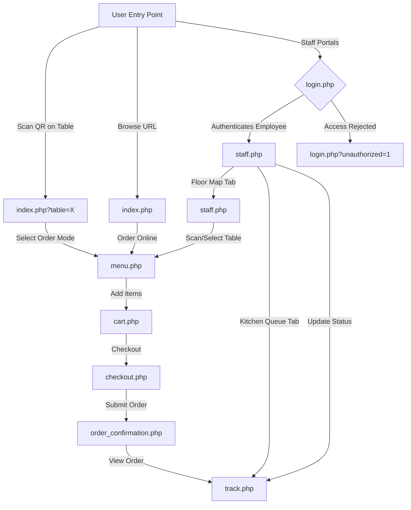

# System Architecture & Routing Skeleton
## Restaurant Order Management System (ZZ Sup Tulang)

This document details the system architecture, folder structure, database schema, and routing skeleton for the ZZ Sup Tulang Order Management System. 

To ensure the skeleton is immediately interactive and testable (even before a MySQL database is configured), the application features a **Dual-Mode Architecture**:
1. **Database Mode (Production/Dev)**: Connects to a MySQL database via PHP and validates sessions.
2. **Client-Side Mock Mode (Instant Test)**: If PHP MySQL connection is offline, the system falls back to utilizing `localStorage` to simulate real-time operations, allowing the Customer, Floor Map, and Kitchen flows to interact seamlessly in the browser.

---

## 1. Directory Structure

The project is organized with the following structure:

```text
-Restaurant-Order-Management-System/
├── config/
│   └── db.php                  # Database connection & table/user auto-creation
├── database/
│   └── schema.sql              # MySQL database schema, seeds (menu & users)
├── includes/
│   ├── auth.php                # Authentication helper (session checks & role gates)
│   ├── header.php              # Global navigation, table parameter parser & role guards
│   └── footer.php              # Global scripts and footer
├── css/
│   └── style.css               # Modern glassmorphic styling & visual design system
├── js/
│   └── app.js                  # Frontend state (cart, receipt preview, mock DB fallbacks)
├── index.php                   # Portal page (Walk-in welcome / Online entrance)
├── login.php                   # Role-based login screen (Staff & Admin credentials check)
├── menu.php                    # Interactive menu page (Categories, filters, cart addition)
├── cart.php                    # Shopping cart management
├── checkout.php                # Checkout page (Bank QR, Payment Gateway Emulator, Receipt upload)
├── order_confirmation.php      # Order receipt and simulated confirmation email dispatch
├── track.php                   # Real-time order progress tracking (AJAX polling)
├── staff.php                   # Unified employee dashboard (Orders Queue & Floor Map views)
├── api.php                     # Backend API handling order status, updates & role verification
└── Resources/                  # Supplied project resources
    └── zzsuptulang/
        ├── menuzz/             # Menu images
        ├── menuzz.pptx
        ├── videozz.mp4
        └── zz.pdf
```

---

## 2. Page Flow & Routing Skeleton

The application supports three distinct user entry points with integrated authentication checks:



### Route Index & Access Controls
*   **Customer Routes (Public)**
    *   `index.php`: Main portal. Automatically routes employees to `staff.php` and table scans to `menu.php?table=X`.
    *   `menu.php`, `cart.php`, `checkout.php`, `order_confirmation.php`, `track.php`: Walk-in and online cart flow. Accessible to anyone.
*   **Employee Routes (Secured - Staff / Admin)**
    *   `staff.php`: Unified dashboard. Restricted to `staff` (or `admin`) sessions. Redirects to `login.php` if unauthenticated.
    *   `qr_generator.php`: Generates table codes. Restricted to `staff` (or `admin`) sessions.

---

## 3. Database Schema (`schema.sql`)

```sql
CREATE DATABASE IF NOT EXISTS `restaurant_db`;
USE `restaurant_db`;

-- ... See database/schema.sql for structural tables ...

-- 5. Users Table (Role-based logins)
CREATE TABLE IF NOT EXISTS `users` (
    `id` INT AUTO_INCREMENT PRIMARY KEY,
    `username` VARCHAR(50) NOT NULL UNIQUE,
    `password` VARCHAR(255) NOT NULL,
    `role` ENUM('staff', 'admin') NOT NULL,
    `created_at` TIMESTAMP DEFAULT CURRENT_TIMESTAMP
) ENGINE=InnoDB DEFAULT CHARSET=utf8mb4;

-- Seed Data (Insert Users)
-- Default passwords are 'password123' hashed using bcrypt
INSERT INTO `users` (`id`, `username`, `password`, `role`) VALUES
(1, 'staff1', '$2y$10$8.X7zQ939FjE6aW3yHjQ4OiYtV7r67bWz5aLg5n3Y35eA2F1O2uO2', 'staff'),
(2, 'staff2', '$2y$10$8.X7zQ939FjE6aW3yHjQ4OiYtV7r67bWz5aLg5n3Y35eA2F1O2uO2', 'staff'),
(3, 'admin1', '$2y$10$8.X7zQ939FjE6aW3yHjQ4OiYtV7r67bWz5aLg5n3Y35eA2F1O2uO2', 'admin')
ON DUPLICATE KEY UPDATE `username`=VALUES(`username`), `role`=VALUES(`role`);
```

---

## 4. Authentication Mechanism & Fallbacks

*   **Database Active**: Verify submitted form passwords using PHP `password_verify()` against the `users` table. On success, store `user_id`, `username`, and `user_role` in `$_SESSION`.
*   **Mock Fallback**: If MySQL connection fails, `login.php` accepts hardcoded developer credentials:
    *   Staff username: `staff1` / `staff2` (password: `password123`)
    *   Admin username: `admin1` (password: `password123`)
*   **Logout Handler**: Accessing `login.php?action=logout` clears the server session, destroying permissions and returning the browser to a guest client state.
